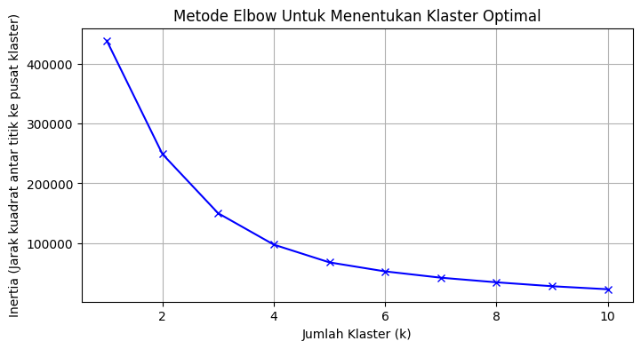
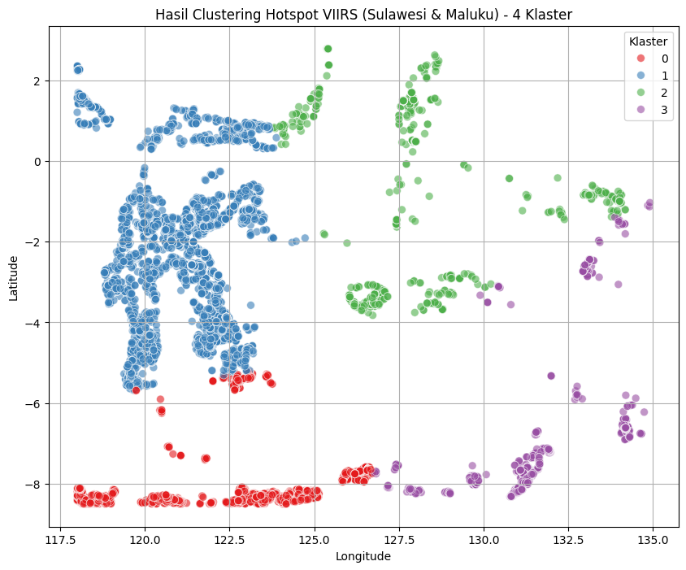

# 🔥 VIIRS Hotspot Clustering — Sulawesi & Maluku

Analisis klasterisasi titik api (*hotspot*) aktif di wilayah **Sulawesi dan Maluku** menggunakan data satelit **VIIRS (Visible Infrared Imaging Radiometer Suite)** dan algoritma **K-Means Clustering**.

---

## 📋 Deskripsi Proyek

Proyek ini bertujuan untuk mengelompokkan titik-titik panas (*hotspot*) yang terdeteksi oleh sensor VIIRS pada satelit Suomi-NPP ke dalam klaster geografis berdasarkan koordinat lokasi. Analisis ini mencakup data dari tahun **2015 hingga 2025** pada wilayah Sulawesi dan Maluku.

Dengan pendekatan *unsupervised learning* (K-Means), titik-titik api yang berdekatan secara geografis dikelompokkan untuk memudahkan identifikasi zona rawan kebakaran hutan dan lahan di kawasan tersebut.

---

## 📁 Struktur Repository

```
viirs-hotspot-clustering-maluku-and-sulawesi/
├── Dataset/
│   └── indonesia-viirs-dataset.csv   # Dataset
├── script/
│   └── Clustering_Data_VIIRS.ipynb   # Notebook utama analisis
├── images/
│   ├── hasil-clustering.png          # Visualisasi hasil 4 klaster
│   └── inertia.png                   # Grafik Elbow Method
└── README.md
└── Hasil_Clustering_VIIRS_SulMal.csv # Hasil Clustering
```

---

## 🗃️ Dataset

| Properti | Detail |
|---|---|
| **Sumber** | NASA FIRMS — VIIRS Suomi-NPP |
| **Format** | CSV |
| **Rentang Waktu** | 2015 – 2025 |
| **Wilayah** | Indonesia |
| **Bounding Box** | Lat: `-8.5` s/d `3.0`, Lon: `118.0` s/d `135.0` |
| **Fitur yang Digunakan** | `latitude`, `longitude` |

Data diakses melalui Google Drive dan difilter berdasarkan rentang waktu dan batas koordinat wilayah Sulawesi–Maluku.

---

## 🛠️ Teknologi & Library

| Library | Kegunaan |
|---|---|
| `pandas` | Manipulasi dan filtering data |
| `scikit-learn` | K-Means Clustering & Silhouette Score |
| `matplotlib` | Visualisasi grafik Elbow Method |
| `seaborn` | Visualisasi hasil klasterisasi |

---

## ⚙️ Metodologi

### 1. Preprocessing Data
- Konversi kolom `acq_date` ke format datetime
- Filter data berdasarkan tahun (2015–2025)
- Filter spasial menggunakan *bounding box* koordinat Sulawesi & Maluku

### 2. Penentuan Jumlah Klaster — Elbow Method
Metode Elbow digunakan untuk menentukan jumlah klaster optimal dengan menghitung nilai **inertia** (jumlah jarak kuadrat setiap titik ke pusat klasternya) untuk k = 1 hingga 10.



Dari grafik terlihat bahwa "siku" (*elbow*) terbentuk pada **k = 4**, sehingga dipilih sebagai jumlah klaster optimal.

### 3. K-Means Clustering
- Jumlah klaster: **k = 4**
- `random_state = 42`, `n_init = 10`
- Input fitur: `longitude` dan `latitude`

### 4. Evaluasi — Silhouette Score
Kualitas klasterisasi dievaluasi menggunakan **Silhouette Score** untuk mengukur seberapa baik setiap titik cocok dengan klasternya sendiri dibanding klaster lain.

---

## 📊 Hasil

### Visualisasi Klaster



Titik api berhasil dikelompokkan menjadi **4 klaster geografis**:

| Klaster | Warna | Area Geografis (Perkiraan) |
|---|---|---|
| 0 | 🔴 Merah | Sulawesi Selatan bagian bawah & kepulauan sekitarnya |
| 1 | 🔵 Biru | Sulawesi Tengah, Utara, dan Barat |
| 2 | 🟢 Hijau | Maluku Utara dan kepulauan tengah |
| 3 | 🟣 Ungu | Maluku Tenggara / Kepulauan Aru |

### Output
File hasil klasterisasi disimpan sebagai:
```
Hasil_Clustering_VIIRS_SulMal.csv
```

---

## 🚀 Cara Menjalankan

### Prasyarat
```bash
pip install pandas scikit-learn matplotlib seaborn
```

### Jalankan Notebook
1. Clone repository ini:
   ```bash
   git clone https://github.com/likeazwee/viirs-hotspot-clustering-maluku-and-sulawesi.git
   cd viirs-hotspot-clustering-maluku-and-sulawesi
   ```

2. Buka Jupyter Notebook:
   ```bash
   jupyter notebook script/Clustering_Data_VIIRS.ipynb
   ```

3. Jalankan semua sel secara berurutan.

---

## 📌 Catatan

- Data VIIRS dapat diakses secara publik melalui [NASA FIRMS](https://firms.modaps.eosdis.nasa.gov/).
- Hasil klasterisasi bersifat spasial murni berdasarkan koordinat, bukan berdasarkan intensitas atau frekuensi kebakaran.
- Proyek ini dapat dikembangkan lebih lanjut dengan menambahkan fitur `brightness`, `frp` (Fire Radiative Power), atau analisis temporal.

---

## 👤 Author

**Agyl Wendi Pratama**  
[github.com/likeazwee](https://github.com/likeazwee)

---

## 📄 Lisensi

Proyek ini bersifat terbuka untuk keperluan edukasi dan penelitian.
